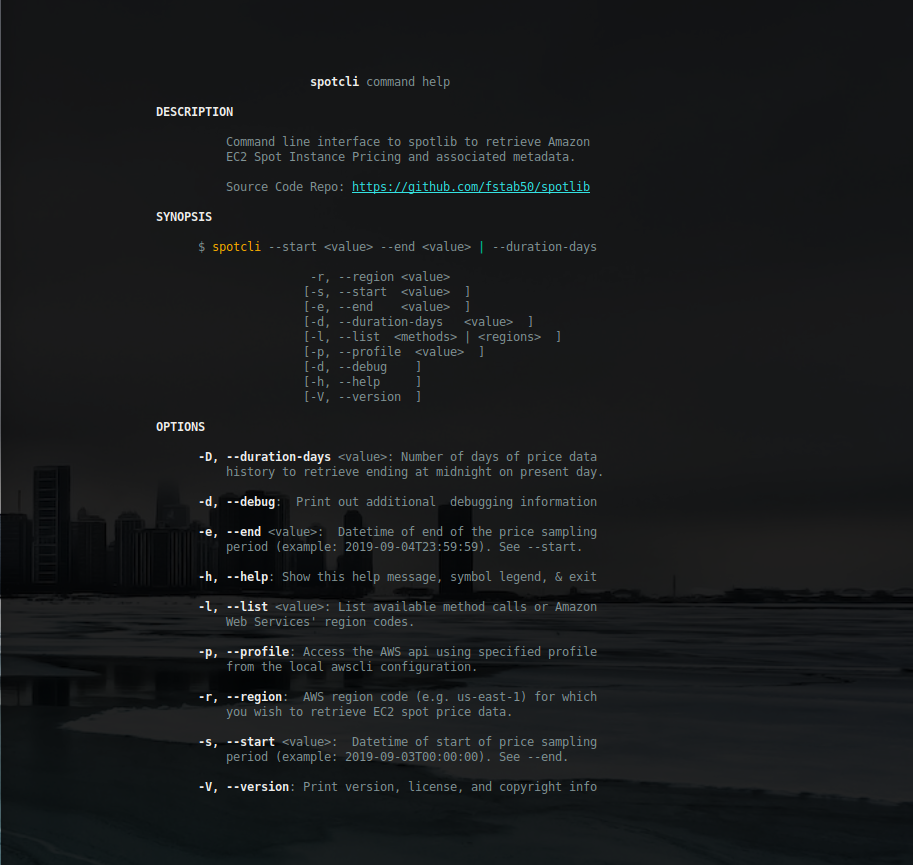
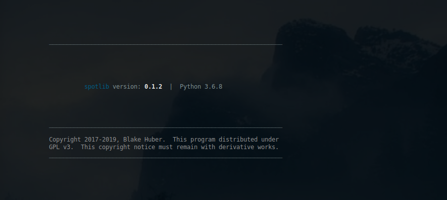

<a name="top"></a>
* * *
# spotlib
* * *

## Summary

Python 3 library for retrieving historical spot prices from [Amazon EC2](http://aws.amazon.com/ec2) Service.

Internally, spotlib utilises a paged generator architecture to achieve maximum performance with non-blocking state transition.

Spotlib can be used as a library or directly as a cli application, as spotlib also includes a **spotcli**, a cli binary which can be used directly for retrieving spot price data.

**Version**: 0.1.1

* * *

## Contents

* [**Dependencies**](#dependencies)

* [**Installation**](#installation)

* [**Use**](#use)
    * [**Library**](#use)
    * [**spotcli**](#spotcli)

* [**Screenshots**](#screenshots)

* [**Author & Copyright**](#author--copyright)

* [**License**](#license)

* [**Disclaimer**](#disclaimer)

--

[back to the top](#top)

* * *

## Dependencies

[spotlib](https://github.com/fstab50/spotlib) requires:

* [Python 3.6+](https://docs.python.org/3/).

* [Boto3](https://boto3.amazonaws.com/v1/documentation/api/latest/reference/services/index.html) Python SDK for Amazon Web Services


[back to the top](#top)

* * *
## Installation

**spotlib** may be installed on Linux via [pip, python package installer](https://pypi.org/project/pip) in one of two methods:

To install **spotlib** for a single user:

```
$  pip3 install spotlib --user
```

To install **spotlib** for all users (Linux):

```
$  sudo -H pip3 install spotlib
```

[back to the top](#top)

* * *
## Use
* * *
### Use / Library

**spotlib** can be used most flexibly as an importable library:

```python
>>> from spotlib import SpotPrices, DurationEndpoints
>>> sp = SpotPrices()

# Display datetime endpoints
>>> sp.start

datetime.datetime(2019, 9, 17, 0, 0)

>>> sp.end

datetime.datetime(2019, 9, 18, 0, 0)
```

* * *
<a name="spotcli"></a>
### Use / spotcli

To display the help menu for **spotcli**, the included command line helper application:

```bash
    $ spotcli --help
```

<p align="center">
    <a href="http://images.awspros.world/spotlib/help-menu.png" target="_blank">
</p>

--

[back to the top](#top)

* * *

## Author & Copyright

All works contained herein copyrighted via below author unless work is explicitly noted by an alternate author.

* Copyright Blake Huber, All Rights Reserved.

[back to the top](#top)

* * *

## License

* Software contained in this repo is licensed under the [license agreement](./LICENSE.md).  You may display the license and copyright information by issuing the following command:

```
$ spotlib --version
```

[](https://s3.us-east-2.amazonaws.com/http-imagestore/spotlib/version-copyright.png)


[back to the top](#top)

* * *

## Disclaimer

*Code is provided "as is". No liability is assumed by either the code's originating author nor this repo's owner for their use at AWS or any other facility. Furthermore, running function code at AWS may incur monetary charges; in some cases, charges may be substantial. Charges are the sole responsibility of the account holder executing code obtained from this library.*

Additional terms may be found in the complete [license agreement](./LICENSE.md).

[back to the top](#top)

* * *
